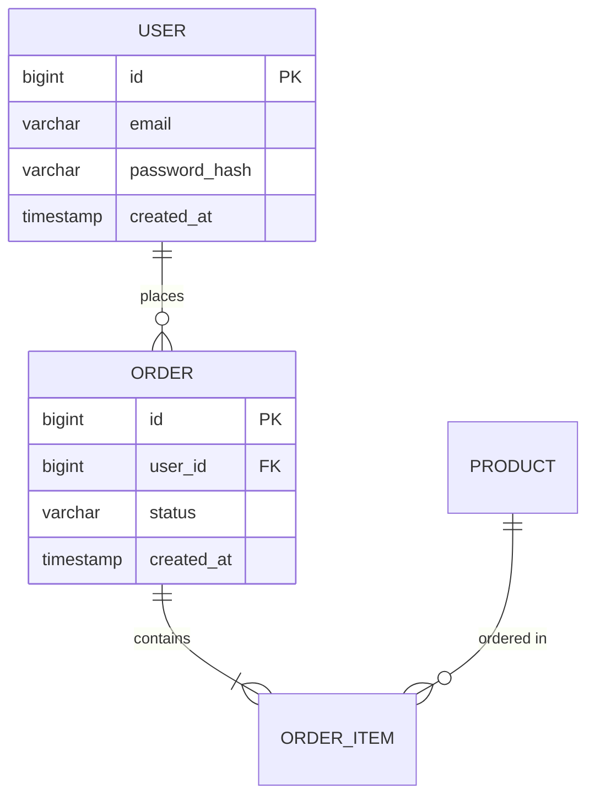

# Entity-Relationship Diagrams

Place database ERD diagrams here.

## Example

```mermaid
erDiagram
    USER ||--o{ ORDER : places
    ORDER ||--|{ ORDER_ITEM : contains
    PRODUCT ||--o{ ORDER_ITEM : "ordered in"

    USER {
        bigint id PK
        varchar email
        varchar password_hash
        timestamp created_at
    }

    ORDER {
        bigint id PK
        bigint user_id FK
        varchar status
        timestamp created_at
    }
```
