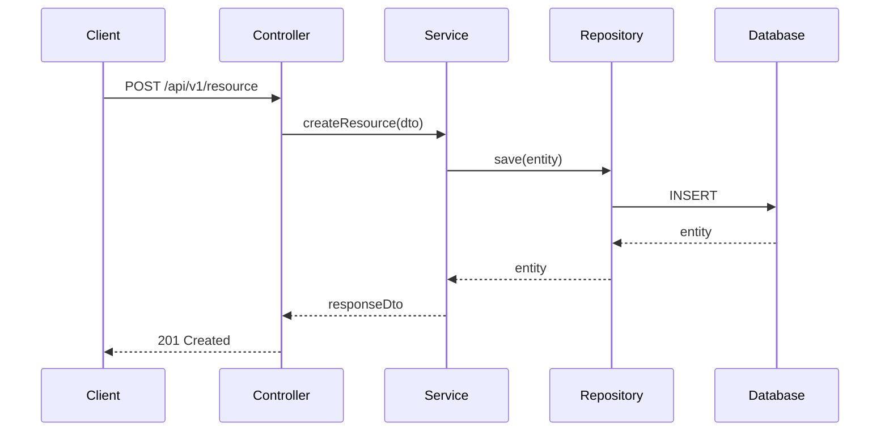

# Sequence Diagrams

Place Mermaid or exported sequence diagrams here.

## Example

```mermaid
sequenceDiagram
    participant Client
    participant Controller
    participant Service
    participant Repository
    participant Database

    Client->>Controller: POST /api/v1/resource
    Controller->>Service: createResource(dto)
    Service->>Repository: save(entity)
    Repository->>Database: INSERT
    Database-->>Repository: entity
    Repository-->>Service: entity
    Service-->>Controller: responseDto
    Controller-->>Client: 201 Created
```
